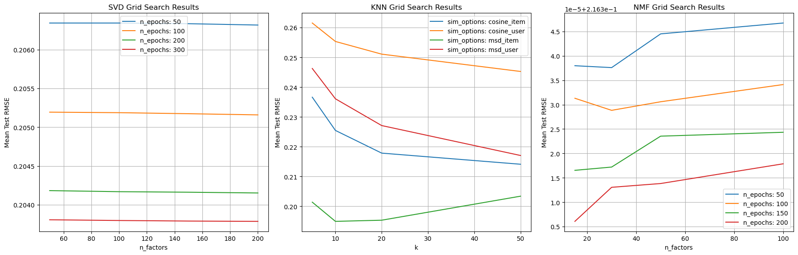
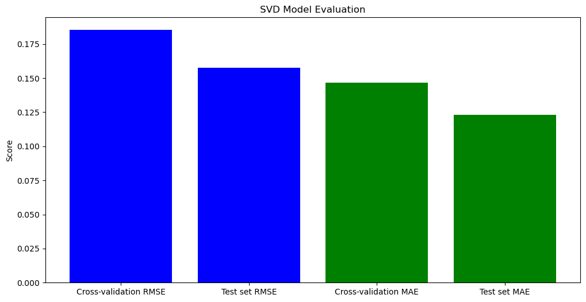

# Brand Recommendation Engine

## NON-TECHNICAL EXPLANATION OF YOUR PROJECT
This project was designed to create a model for use in recommending brands to users on our network.  The code is spread over six Jupyter Notebook files with each file dedicated to a specific step in the model building process.
- *step_1_data_sanitation.ipynb* - Data Sanitation
- *step_2_data_exploration.ipynb* - Data Exploration
- *step_3_data_preparation.ipynb* - Data Preparation
- *step_4_model_comparison.ipynb* - Model Comparison
- *step_5_model_training_and_evaluation.ipynb* - Model Training and Evaluation
- *step_6_model_testing.ipynb* - Model Testing and Inference Example

## DATA
The data has come from our own database and includes interactions been brands and users over many years.  There are three data files:
- Brand data
- User data
- Interactions data 

## MODEL 
We are using the SVD model from the scikit-surprise library.  This model was selected from three candidates (SVD, KNN, and NMF) and were evaluated together.  

## HYPERPARAMETER OPTIMSATION
We used a grid search to find the optimal hyperparameters for the SVD model.  These are:
- n_factors: 50
- n_epochs: 300
- lr_all: 0.005
- reg_all: 0.02

## RESULTS
Cross-validation evaluation of RMSE and MAE over 5 split(s).

| Metric          | Fold 1  | Fold 2  | Fold 3  | Fold 4  | Fold 5  | Mean    | Std    |
|-----------------|---------|---------|---------|---------|---------|---------|--------|
| RMSE  | 0.1859  | 0.1844  | 0.1857  | 0.1849  | 0.1857  | 0.1853  | 0.0006 |
| MAE   | 0.1474  | 0.1462  | 0.1468  | 0.1460  | 0.1469  | 0.1467  | 0.0005 |
| Fit time        | 6.99    | 6.86    | 7.17    | 6.94    | 6.80    | 6.95    | 0.13   |
| Test time       | 0.06    | 0.18    | 0.06    | 0.06    | 0.06    | 0.09    | 0.05   |

- **RMSE (Test set)**: 0.1578
- **MAE (Test set)**: 0.1229  

